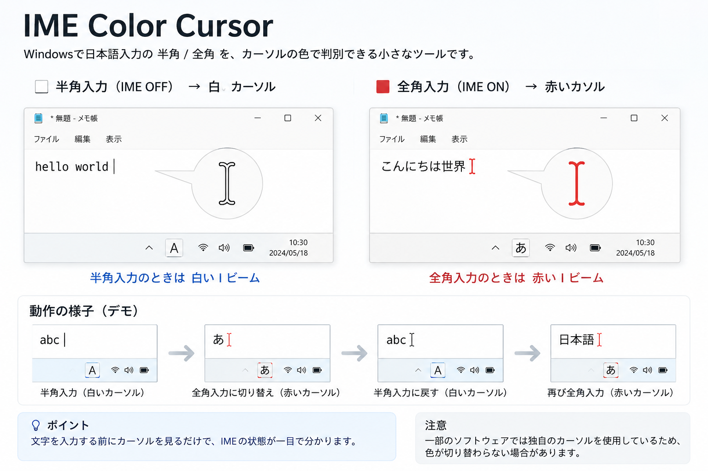

# IME Color Cursor

Windowsで日本語入力の **半角 / 全角** を、カーソルの色で判別できる小さなツールです。

- ⬜ 半角入力（IME OFF） → 白いIビーム
- 🟥 全角入力（IME ON） → 赤いIビーム

文字を入力する前にカーソルを見るだけで、IMEの状態が一目で分かります。

---

## なぜ作ったの？

HTML・CSS・JavaScript・ChatGPTなど、
半角入力と全角入力を何度も切り替えながら作業していると、

「あっ、全角だった…」

という入力ミスが何度も起こります。

WindowsにはIMEの状態を表示する機能がありますが、
視線を右下のタスクバーへ移動しないと確認できません。

そこで、

**「カーソル自体の色を変えればいいのでは？」**

という発想から作りました。

---

## 特徴

- 軽量
- 常駐しても負荷はほぼありません
- IMEのON/OFFをリアルタイム検知
- Windows標準のIビームカーソルのみ変更
- 終了すると標準カーソルへ自動で戻ります

---

## 動作環境

- Windows 11
- AutoHotkey v2

※Windows10でも動作する可能性がありますが未検証です。

---

## 使い方

1. AutoHotkey v2 をインストール
2. このプロジェクトをダウンロード
3. `IME Color Cursor.ahk` を実行

終了するとカーソルは自動で元へ戻ります。

---

## スクリーンショット

---

## 注意

一部のソフトウェアは独自カーソルを使用しているため、
色が切り替わらない場合があります。

---

## ライセンス

MIT License

---

## 作者

大好き工房

もし気に入っていただけたら、
GitHubの ⭐ を付けてもらえるとうれしいです。

## 📦 ダウンロード

最新版はこちらから

https://github.com/Nbeyaki-kira/ime-color-cursor/releases/latest
